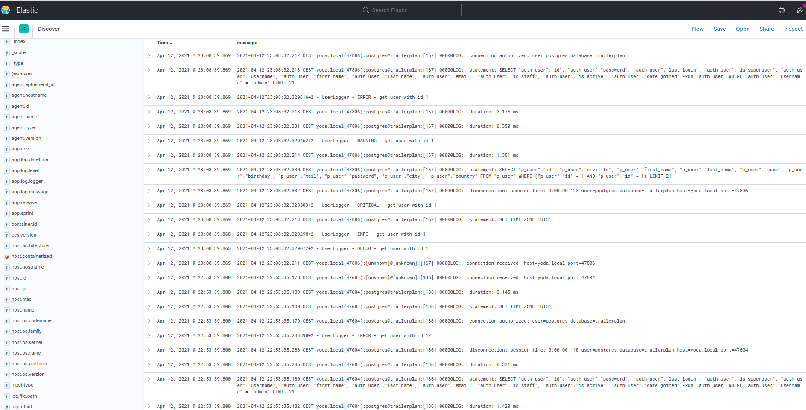
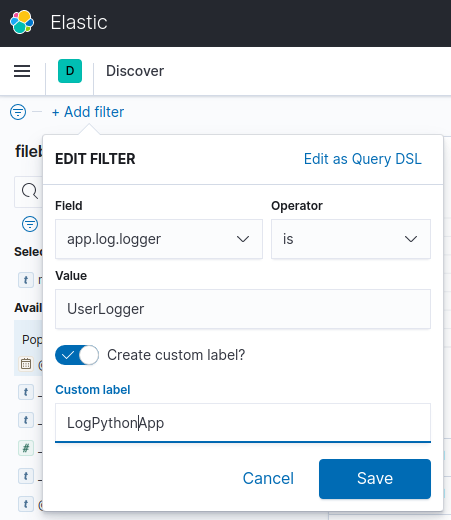
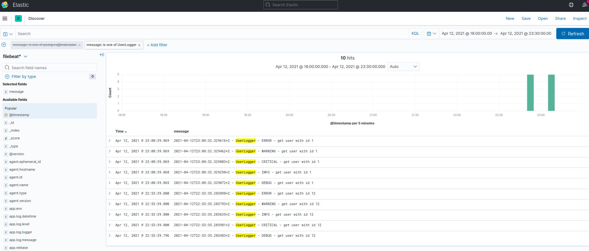
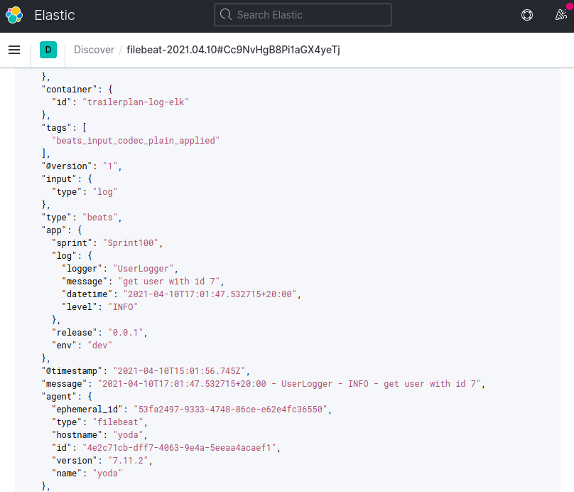

TRAILERPLAN APP WITH POSTGRESQL AND LOGGING TO ELK STACK 
========================================================

This is the trailerplan project with a Python Django rest service using a postgresql database and logging
(app python and pgsql) to the ELK stack. 
It use filebeat to send the logs of the python application and postgresql to logstash.
There are 3 dockers containers run from docker compose.


# 1. Python application 
The application is limited to the 'get by id' function and the 'get all' function of objects.
In each function some logs were thrown with level debug, info, warn, error and critical.
The logs are write in an file in log directory of the application.


## 1.1. Timestamp of the logs
The time zone will be change to your own ime zone here :<br>
z = utc_offset_string(record.created)<br>
to z = utc_offset_string(record.created, "America/New_York"), if your locl timezone is "America/New_York" ;-)
           
If it is empty it takes the default timezone, my local timezone :-)

The format of the logs is as follows :<br>
[year]-[month]-[day]T[hour]:[minute]:[second].[microseconds]+[utc offset]
The microseconds were chosen in order to have a difference between 2 logs

example of logs :
```log
2021-04-11T11:15:50.553891+2 - UserLogger - DEBUG - get user with id 1
2021-04-11T11:15:50.553976+2 - UserLogger - INFO - get user with id 1
2021-04-11T11:15:50.554043+2 - UserLogger - WARNING - get user with id 1
2021-04-11T11:15:50.554105+2 - UserLogger - ERROR - get user with id 1
2021-04-11T11:15:50.554166+2 - UserLogger - CRITICAL - get user with id 1
```

NB:the time zone is CEST (UTC+1). But it is is +2 because it is summer time ;-)

## 1.2. Settings
To access to the postgresql database it need his ip address ~/app_python/app_python/settings.py.
The ip address of postgresql will be found by the docker network or the container postgresql.

- the network:
```shell script
$ docker network inspect trailerplan-log-elk_postgres-network
```
the ip address can be found in :
```shell script
...
       "Containers": {
            "b921080093537e26520bdb63116dce8395090829f1d94d124c215a9e9de711a1": {
                "Name": "postgres-container",
                "EndpointID": "5bab3e21392a4d223b7cd4fb7960cd58687d486e045027050b3e6edf9b2a1809",
                "MacAddress": "02:42:ac:15:00:02",
                "IPv4Address": "172.21.0.2/16",
                "IPv6Address": ""
            }
        },

...
```
here it is : **172.21.0.2** ;-)

- the container:
```shell script
$ docker container inspect postgres-container
```

the ip address can be found in :
```shell script
...
           "Networks": {
                "trailerplan-log-elk_postgres-network": {
                    "IPAMConfig": null,
                    "Links": null,
                    "Aliases": [
                        "postgres",
                        "b92108009353",
                        "postgres-server"
                    ],
                    "NetworkID": "422ae24637ff4c96ecacb38d9eb5ca75ecd36b1a0dd13b3cd0ac747e041a8e65",
                    "EndpointID": "5bab3e21392a4d223b7cd4fb7960cd58687d486e045027050b3e6edf9b2a1809",
                    "Gateway": "172.21.0.1",
                    "IPAddress": "172.21.0.2",
                    "IPPrefixLen": 16,
                    "IPv6Gateway": "",
                    "GlobalIPv6Address": "",
                    "GlobalIPv6PrefixLen": 0,
                    "MacAddress": "02:42:ac:15:00:02",
                    "DriverOpts": null
                }
            }
...
```
here it is : **172.21.0.2** ;-)

## 1.3. Dockerfile
This is a classic dockerfile from a python application, also from one of my other python projects in my repository ;-).
The [dockerfile](./docker/app_python/Dockerfile)

## 1.4. Docker compose
In the docker compose, the python application is launch by the service app_python. The image was defined in order to have the image name and tag in docker local repository.
```shell script
...
services:
  app_python:
    restart: always
    image: ${APP_PROJECT}/${APP_SUB_PROJECT}:${APP_VERSION}
    hostname: ${APP_HOSTNAME}
    container_name: ${APP_CONTAINER_NAME}
    environment:
      POSTGRES_USER: ${POSTGRES_USER}
      POSTGRES_PASSWORD: ${POSTGRES_PASSWORD}
    build:
      context: .
      dockerfile: ./docker/app_python/Dockerfile
    env_file:
      - ./docker/config/env.dev
    volumes:
      - ./app_python/:/app/
    ports:
      - "${APP_RUNNING_SERVER_PORT}:${APP_RUNNING_SERVER_PORT}"
    command: python manage.py runserver 0.0.0.0:${APP_RUNNING_SERVER_PORT}
    depends_on:
      - postgres
    networks:
      - postgres-network
...
```

in the local repositoty :
```shell script
$ docker images 
REPOSITORY                      TAG                 IMAGE ID       CREATED         SIZE
trailerplan/app-python_pg_elk   0.0.1               bd4af9000d01   38 hours ago    170MB
...
```

## 1.5. The parameters to customize the service 
The parameters are in the file : `~/docker/config/env.dev`. [env.dev](./docker/config/env.dev) <br>
A classical use case is to define another settings file for another platform (env.test, env.staging, env.prd, ...).

```shell script
...
APP_PROJECT=trailerplan
APP_SUB_PROJECT=app-python_pg_elk
APP_VERSION=0.0.1
APP_CONTAINER_NAME=app_python-container
APP_HOSTNAME=app_python-server
APP_RUNNING_SERVER=localhost
APP_RUNNING_SERVER_PORT=8001
...
```

## 1.6. Filebeat
After installing filebeat (in my linux development environment), its configuration will be done in the local host for version 0.1.0 of this project.
In another version, this will be done with a filebeat in a docker image.
 
```shell script
$ sudo apt-get install filebeat

$ sudo filebeat version
filebeat version 7.11.2 (amd64), libbeat 7.11.2 [1d9cced55410003f5d0b4594ff5471d15a4e2900 built 2021-03-06 05:39:43 +0000 UTC]
```

the configuration is in /etc/filebeat/filebeat.yml
```shell script
filebeat.inputs:

- type: log
  enabled: true
  paths:
    - [ABSOLUTE_PATH]/trailerplan-log-elk/app_python/log/*.log
...
```

to start the service :
```shell script
$ sudo systemctl start filebeat.service
```

```shell script
$ sudo systemctl status filebeat.service 
● filebeat.service - Filebeat sends log files to Logstash or directly to Elasticsearch.
     Loaded: loaded (/lib/systemd/system/filebeat.service; enabled; vendor preset: enabled)
     Active: active (running) since Sun 2021-04-11 15:49:58 CEST; 4s ago
       Docs: https://www.elastic.co/products/beats/filebeat
   Main PID: 28674 (filebeat)
      Tasks: 17 (limit: 37963)
     Memory: 26.2M
     CGroup: /system.slice/filebeat.service
             └─28674 /usr/share/filebeat/bin/filebeat --environment systemd -c /etc/filebeat/filebeat.yml --path.home /usr/share/filebeat --path.config /etc/filebeat --path.data /var/lib/filebeat --path.logs /var/log/filebeat
```

<br>
NB: after updating the configuration don't forget to restart the service :

```shell script
$ sudo systemctl restart filebeat.service
```

## 1.7. Logs in Kibana
After the fields are reindexed, we can see the logs for postgresql and the python app.

<br>
we see the logs displayed with the filter



the json view for an log:


The appplication log is in the json message in the following form. This was enabled with grok parsing 
and the mutate function in the logstash configuration.
```shell script
...   
  "app": {
      "log": {
        "level": "INFO",
        "logger": "UserLogger",
        "datetime": "2021-04-08T23:28:27.533120+2:00",
        "message": "get user with id 4"
      },
      "env": "dev",
      "release": "0.0.1",
      "sprint": "Sprint100",
    },
...
``` 

reference : [Filebeat reference](https://www.elastic.co/guide/en/beats/filebeat/current/index.html)

# 2. Database postgresql
The postgresql database was used with a data initialization with some elite ultra-trailers, that's my sport ;-)

## 2.1. Schema and data
The list is in `./docker/postgres/db-postgres-2-data.sql` and the schema of this database is `./docker/postgres/db-postgres-1-schema.sql`
The mail and password are some fake information but the other are public and they come from wikipedia.

## 2.2. Configuration
The config come from the docker image from version 12.5-alpine and the directory `/var/lib/posgtresql/data/postgresql.conf`.
The config file is mount as a volume in order to make easily the configuration in development phase.

The parameters that have been changed are mainly :
```shell script
log_directory = 'pg_log'	# directory where log files are written,
log_filename = 'postgresql-%Y-%m-%d_%H%M%S.log'	# log file name pattern,
log_line_prefix = '%m:%r:%u@%d:[%p] %e'		# special values:
					#   %m = timestamp with milliseconds
					#   %r = remote host name or IP address, and remote port
					#   %u = user name
					#   %d = database name
					#   %p = process ID
					#   %e = SQL state error code
```

## 2.3. Example of logs

sample logs for the user list service :
```log
2021-04-11 17:12:09.187 CEST:yoda.local(50034):[unknown]@[unknown]:[917] 00000LOG:  connection received: host=yoda.local port=50034
2021-04-11 17:12:09.187 CEST:yoda.local(50034):postgres@trailerplan:[917] 00000LOG:  connection authorized: user=postgres database=trailerplan
2021-04-11 17:12:09.188 CEST:yoda.local(50034):postgres@trailerplan:[917] 00000LOG:  statement: SET TIME ZONE 'UTC'
2021-04-11 17:12:09.188 CEST:yoda.local(50034):postgres@trailerplan:[917] 00000LOG:  duration: 0.115 ms
2021-04-11 17:12:09.188 CEST:yoda.local(50034):postgres@trailerplan:[917] 00000LOG:  statement: 
                    SELECT c.relname,
                    CASE WHEN c.relispartition THEN 'p' WHEN c.relkind IN ('m', 'v') THEN 'v' ELSE 't' END
                    FROM pg_catalog.pg_class c
                    LEFT JOIN pg_catalog.pg_namespace n ON n.oid = c.relnamespace
                    WHERE c.relkind IN ('f', 'm', 'p', 'r', 'v')
                        AND n.nspname NOT IN ('pg_catalog', 'pg_toast')
                        AND pg_catalog.pg_table_is_visible(c.oid)
                
2021-04-11 17:12:09.190 CEST:yoda.local(50034):postgres@trailerplan:[917] 00000LOG:  duration: 1.623 ms
2021-04-11 17:12:09.192 CEST:yoda.local(50034):postgres@trailerplan:[917] 00000LOG:  statement: SELECT "django_migrations"."id", "django_migrations"."app", "django_migrations"."name", "django_migrations"."applied" FROM "django_migrations"
2021-04-11 17:12:09.192 CEST:yoda.local(50034):postgres@trailerplan:[917] 00000LOG:  duration: 0.227 ms
2021-04-11 17:12:22.751 CEST:yoda.local(50044):[unknown]@[unknown]:[918] 00000LOG:  connection received: host=yoda.local port=50044
2021-04-11 17:12:22.752 CEST:yoda.local(50044):postgres@trailerplan:[918] 00000LOG:  connection authorized: user=postgres database=trailerplan
2021-04-11 17:12:22.753 CEST:yoda.local(50044):postgres@trailerplan:[918] 00000LOG:  statement: SET TIME ZONE 'UTC'
2021-04-11 17:12:22.753 CEST:yoda.local(50044):postgres@trailerplan:[918] 00000LOG:  duration: 0.149 ms
2021-04-11 17:12:22.753 CEST:yoda.local(50044):postgres@trailerplan:[918] 00000LOG:  statement: SELECT "auth_user"."id", "auth_user"."password", "auth_user"."last_login", "auth_user"."is_superuser", "auth_user"."username", "auth_user"."first_name", "auth_user"."last_name", "auth_user"."email", "auth_user"."is_staff", "auth_user"."is_active", "auth_user"."date_joined" FROM "auth_user" WHERE "auth_user"."username" = 'admin' LIMIT 21
2021-04-11 17:12:22.754 CEST:yoda.local(50044):postgres@trailerplan:[918] 00000LOG:  duration: 1.400 ms
2021-04-11 17:12:22.859 CEST:yoda.local(50044):postgres@trailerplan:[918] 00000LOG:  statement: SELECT "p_user"."id", "p_user"."civilite", "p_user"."first_name", "p_user"."last_name", "p_user"."sexe", "p_user"."birthday", "p_user"."mail", "p_user"."password", "p_user"."city", "p_user"."country" FROM "p_user" ORDER BY "p_user"."last_name" ASC
2021-04-11 17:12:22.860 CEST:yoda.local(50044):postgres@trailerplan:[918] 00000LOG:  duration: 0.505 ms
2021-04-11 17:12:22.861 CEST:yoda.local(50044):postgres@trailerplan:[918] 00000LOG:  disconnection: session time: 0:00:00.112 user=postgres database=trailerplan host=yoda.local port=50044
```


sample logs for the user's detail service :
```log
2021-04-11 11:16:50.637 CEST:yoda.local(46256):[unknown]@[unknown]:[192] 00000LOG:  connection received: host=yoda.local port=46256
2021-04-11 11:16:50.638 CEST:yoda.local(46256):postgres@trailerplan:[192] 00000LOG:  connection authorized: user=postgres database=trailerplan
2021-04-11 11:16:50.639 CEST:yoda.local(46256):postgres@trailerplan:[192] 00000LOG:  statement: SET TIME ZONE 'UTC'
2021-04-11 11:16:50.639 CEST:yoda.local(46256):postgres@trailerplan:[192] 00000LOG:  duration: 0.242 ms
2021-04-11 11:16:50.639 CEST:yoda.local(46256):postgres@trailerplan:[192] 00000LOG:  statement: SELECT "auth_user"."id", "auth_user"."password", "auth_user"."last_login", "auth_user"."is_superuser", "auth_user"."username", "auth_user"."first_name", "auth_user"."last_name", "auth_user"."email", "auth_user"."is_staff", "auth_user"."is_active", "auth_user"."date_joined" FROM "auth_user" WHERE "auth_user"."username" = 'admin' LIMIT 21
2021-04-11 11:16:50.640 CEST:yoda.local(46256):postgres@trailerplan:[192] 00000LOG:  duration: 1.180 ms
2021-04-11 11:16:50.742 CEST:yoda.local(46256):postgres@trailerplan:[192] 00000LOG:  statement: SELECT "p_user"."id", "p_user"."civilite", "p_user"."first_name", "p_user"."last_name", "p_user"."sexe", "p_user"."birthday", "p_user"."mail", "p_user"."password", "p_user"."city", "p_user"."country" FROM "p_user" WHERE ("p_user"."id" = 1 AND "p_user"."id" = 1) LIMIT 21
2021-04-11 11:16:50.742 CEST:yoda.local(46256):postgres@trailerplan:[192] 00000LOG:  duration: 0.313 ms
2021-04-11 11:16:50.744 CEST:yoda.local(46256):postgres@trailerplan:[192] 00000LOG:  disconnection: session time: 0:00:00.109 user=postgres database=trailerplan host=yoda.local port=46256
```


